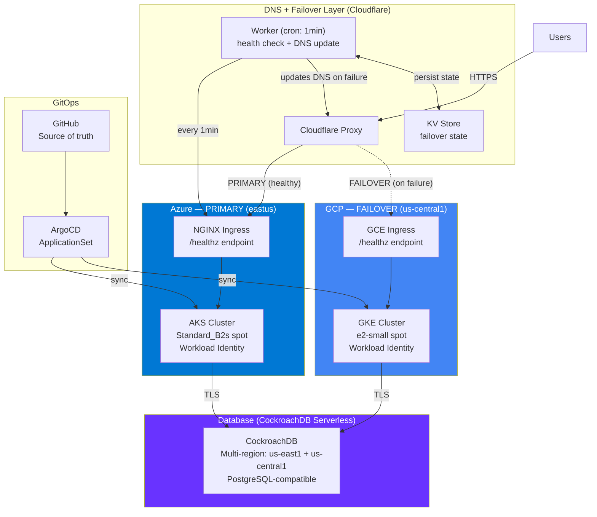
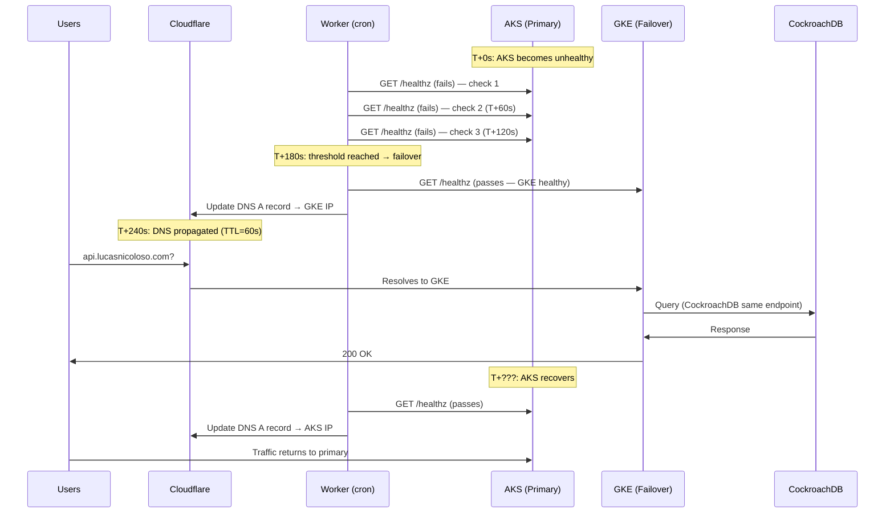
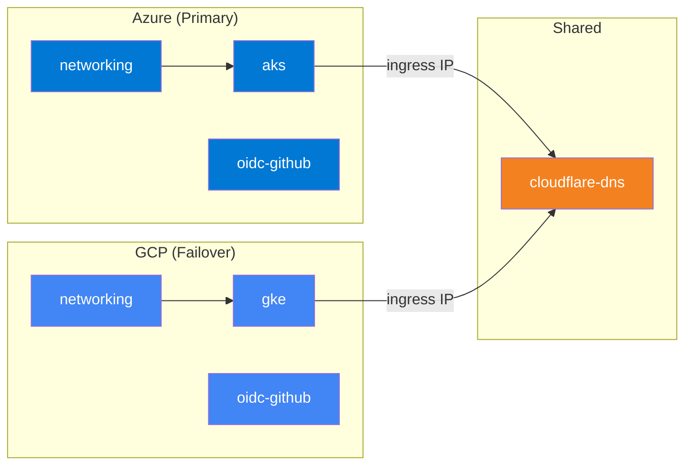

# ⚠️ ATENÇÃO: PROJETO MIGRADO PARA SIMULAÇÃO VISUAL ⚠️

**Este projeto de infraestrutura multi-cloud foi desativado devido a custos inesperados.**
A arquitetura distribuída entre Azure e GCP está sendo desmontada para evitar cobranças adicionais.

## 🎯 Nova Direção: Demonstração Visual no Cloudflare Pages
- **Repositório privado**: [`multi-cloud-simulation`](https://github.com/LucasNic/multi-cloud-simulation)
- **Hospedagem gratuita**: Cloudflare Pages (como lucasnicoloso.com)
- **Foco**: Interface visual simulando o failover multi-cloud sem custos de infraestrutura
- **Status**: Apenas frontend estático, sem backends reais em nuvem

## 🛑 Ações Tomadas
1. **Rollback** do código aplicativo (6 commits) no repositório `multi-cloud-app`
2. **Comentários de aviso** em todos os arquivos `terragrunt.hcl`
3. **Repositório privado** criado para a simulação visual
4. **Documentação atualizada** com este aviso

## 📋 Instruções para Destruir Recursos Existentes
Se você precisa destruir recursos já provisionados:
```bash
cd live/gcp/us-central1/dev/networking && terragrunt destroy
cd live/gcp/us-central1/dev/gke && terragrunt destroy
cd live/azure/eastus/dev/networking && terragrunt destroy
cd live/azure/eastus/dev/aks && terragrunt destroy
```

**AVISO**: Execute apenas se tiver certeza e credenciais válidas. A destruição é irreversível.

---

# Multi-Cloud Resilient Platform (Arquivo Histórico)

> **TL;DR**: Active-passive multi-cloud failover with AKS/Azure (primary) and GKE/GCP (failover), automated DNS failover via Cloudflare Workers, GitOps deployment with ArgoCD, and OIDC-based CI/CD. RTO: ~4 minutes. Cost: ~R$60/month. Zero stored secrets.

[](https://github.com/LucasNic/multi-cloud-resilience-platform/actions)
[](https://www.checkov.io/)
[](https://www.infracost.io/)

---

## Why Multi-Cloud?

Not for the resume. **For resilience.**

This project implements an active-passive failover pattern where Azure is the primary cloud and GCP is the warm standby. If AKS goes down, a Cloudflare Worker automatically redirects all traffic to GKE within ~4 minutes — no human intervention required.

The DNS failover layer runs on **Cloudflare, outside both clouds**, eliminating the single point of failure that would exist if a cloud-native DNS service were used to trigger failover away from itself.

## Architecture



## Architectural Decisions & Trade-offs

| Decision | Choice | Trade-off |
|---|---|---|
| **Strategy** | Active-Passive (not Active-Active) | (+) Simple data model. (-) ~4 min outage during failover. [ADR-001](docs/adr/001-active-passive-strategy.md) |
| **Primary Cloud** | Azure AKS + Standard_B2s spot | (+) Free control plane, strong market recognition. (-) Spot can be evicted. [ADR-001](docs/adr/001-active-passive-strategy.md) |
| **Failover Cloud** | GCP GKE + spot e2-small | (+) Free control plane. (-) Spot nodes can be reclaimed. [ADR-001](docs/adr/001-active-passive-strategy.md) |
| **Database** | CockroachDB Serverless (multi-region) | (+) True DB failover, free, PostgreSQL-compatible. (-) 50M RU/month limit. [ADR-005](docs/adr/005-data-strategy.md) |
| **DNS Failover** | Cloudflare Workers (outside both clouds) | (+) No cloud SPOF for DNS. (-) 1-min cron = ~4 min RTO. [ADR-007](docs/adr/007-dns-failover.md) |
| **Identity** | OIDC federation (GitHub → Azure/GCP) | (+) Zero stored secrets. (-) Bootstrap requires local auth. [ADR-004](docs/adr/004-oidc-federation.md) |
| **GitOps** | ArgoCD ApplicationSet | (+) Both clusters always in sync. (-) Another system to operate. [ADR-006](docs/adr/006-gitops-argocd.md) |

## What Happens When It Breaks

> Full runbook: [docs/runbooks/failover-scenario.md](docs/runbooks/failover-scenario.md)



**Timeline:**
- **T+0s**: AKS `/healthz` stops responding
- **T+180s**: Worker detects 3 consecutive failures
- **T+240s**: DNS resolves to GKE (~4 min total RTO)
- **Database**: No interruption — both clusters use the same CockroachDB endpoint
- **Recovery**: Automatic failback when AKS passes health check

## Project Structure

```
.
├── modules/                        # Pure Terraform (reusable, versioned)
│   ├── azure/
│   │   ├── aks/                    # Primary cluster (B2s spot, Workload Identity)
│   │   ├── networking/             # VNet, subnet, NSG
│   │   └── oidc-github/            # Workload Identity Federation for GitHub Actions
│   ├── gcp/
│   │   ├── gke/                    # Failover cluster (spot e2-small, Workload Identity)
│   │   ├── networking/             # VPC, subnets, firewall rules
│   │   └── oidc-github/            # Workload Identity Pool for GitHub Actions
│   └── shared/
│       ├── cloudflare-dns/         # DNS records + Worker script + KV state
│       │   └── worker/
│       │       └── failover.js     # Health check + DNS update logic
│       ├── cockroachdb/            # Serverless cluster + DB + user
│       └── observability/          # Prometheus rules + Helm values
│
├── live/                           # Terragrunt orchestration
│   ├── terragrunt.hcl              # Root: GCS state, provider generation
│   ├── azure/eastus/dev/           # Azure primary environment
│   │   ├── networking/             # ← deployed first
│   │   ├── aks/                    # ← depends on networking
│   │   └── oidc-github/
│   ├── gcp/us-central1/dev/        # GCP failover environment
│   │   ├── networking/             # ← deployed first
│   │   ├── gke/                    # ← depends on networking
│   │   └── oidc-github/
│   └── shared/global/dev/          # Cloud-agnostic resources
│       └── cloudflare-dns/         # ← depends on aks + gke outputs
│
├── k8s/                            # Kubernetes manifests (GitOps)
│   ├── base/                       # Shared: deployment, service, network policy
│   ├── overlays/azure/             # AKS patches (NGINX ingress, Workload Identity)
│   ├── overlays/gcp/               # GKE patches (GCE ingress, 1 replica)
│   └── argocd-applicationset.yaml  # Multi-cluster deployment
│
├── docs/
│   ├── adr/                        # Architecture Decision Records (8 ADRs)
│   └── runbooks/                   # Failure scenarios & procedures
│
├── .github/workflows/              # CI/CD: lint → scan → plan → apply
├── bootstrap/                      # OIDC federation setup guide
└── Makefile                        # Developer workflow shortcuts
```

## Dependency Graph



## Observability

Both clusters run the same monitoring stack via ArgoCD:

| Layer | Tool | Purpose |
|---|---|---|
| **Metrics** | Prometheus + kube-prometheus-stack | Pod/node metrics, custom app metrics via `/metrics` |
| **Alerts** | PrometheusRule CRDs | Error rate >1%, p99 >500ms, crash loops, DB connection failures |
| **Logs** | Fluent Bit → Azure Monitor (AKS) / Cloud Logging (GKE) | Centralized logs per cloud |
| **Dashboards** | Grafana or native cloud dashboards | Cluster health, failover status |
| **Health** | `/healthz`, `/readyz`, `/livez` endpoints | Cloudflare Worker check + K8s internal probes |
| **Failover state** | Cloudflare KV | Current target (aks/gke), failure count, last failover timestamp |

## Security

- **Zero stored secrets in CI**: OIDC federation for Azure + GCP
- **Azure Managed Identity**: cluster-level (System-Assigned), no service principal secrets
- **Azure Workload Identity**: Pod-level Azure AD identity
- **GKE Workload Identity**: Pod-level GCP IAM
- **CockroachDB TLS**: All connections use TLS with certificate verification
- **K8s Network Policies**: Pod-to-pod traffic restricted
- **Cloudflare Proxy**: Origin IPs hidden from public internet
- **Checkov scanning**: Every PR scanned for CIS benchmarks

## Cost

| Resource | Monthly Cost |
|---|---|
| Azure AKS control plane | R$0 (free) |
| Azure Standard_B2s spot node | ~R$45 |
| GCP GKE control plane | R$0 (free, 1 zonal cluster) |
| GCP e2-small spot | ~R$15 |
| CockroachDB Serverless | R$0 (free tier) |
| Cloudflare Workers + DNS | R$0 (free tier) |
| **Total** | **~R$60/month** |

## Quick Start

```bash
git clone https://github.com/LucasNic/multi-cloud-resilience-platform.git
cd multi-cloud-resilience-platform

# 1. Bootstrap OIDC (one-time, see bootstrap/README.md)
# 2. Deploy primary (Azure)
make plan CLOUD=azure
make apply CLOUD=azure

# 3. Deploy failover (GCP)
make plan CLOUD=gcp
make apply CLOUD=gcp

# 4. Deploy shared (Cloudflare DNS)
make plan CLOUD=shared
make apply CLOUD=shared

# 5. Test failover
make failover-test

# 6. Destroy (if needed)
make destroy CLOUD=shared && make destroy CLOUD=gcp && make destroy CLOUD=azure
```

## About

**Lucas Nicoloso** — DevOps/SRE Engineer with 10+ years of hands-on experience building and scaling infrastructure for high-traffic platforms across AWS, GCP, Azure, and OCI.

## License

MIT
